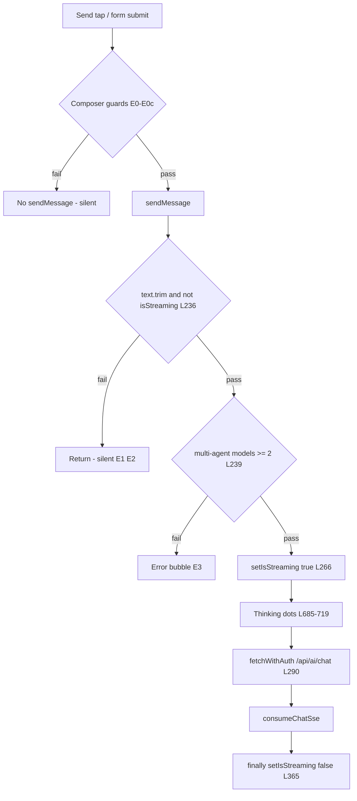

# Chat send-path audit — silent failures & thinking animation (2026-05-21)

**Scope:** Static read-only trace of the Markets **news/chat** send path in `artifacts/alpha-terminal` (component `MarketNewsChatPanel`).  
**Baseline:** `main` at merge of PR #453 (`856c0d54`, auth `fetchWithAuth` wrapper) and PR #455 (retry wiring). This audit does **not** include unmerged commit `cbee192a` (pointerdown send fix).  
**Question:** Where can the handler exit **without** calling `fetchWithAuth("/api/ai/chat", …)` or **without** surfacing an error — especially on the first tap with **no** thinking dots?

---

## Phase 1 — Send path call chain

### UI entry (composer)

| Step | Location | Call |
|------|----------|------|
| 1a | `MarketNewsChatPanel.tsx` L477–487 | Send `<button type="button">` `onClick` → `if (input.trim()) void sendMessage(input)` |
| 1b | `MarketNewsChatPanel.tsx` L446–448 | `<form onSubmit>` → `e.preventDefault()` → `if (input.trim() && !isStreaming) void sendMessage(input)` |
| 1c | `MarketNewsChatPanel.tsx` L676–678 | Per-message **Retry** → `handleRetry` |
| 1d | `MarketNewsChatPanel.tsx` L673–674 | `AssistantListenButton` `onRetry` → `regenerateAssistantMessage` |

Send button is **`type="button"`** (not `submit`), so the primary mobile/desktop path is **1a**, not form submit. The textarea has **no** `onKeyDown` Enter handler; Enter inserts a newline unless the platform implicitly submits the form.

### Secondary entry (retry / regenerate)

| Step | Location | Call |
|------|----------|------|
| 2a | `MarketNewsChatPanel.tsx` L418–427 | `handleRetry` → `void sendMessage(lastFailedMessage, { truncateToIndex })` or `void sendMessage(lastFailedMessage)` |
| 2b | `MarketNewsChatPanel.tsx` L399–414 | `regenerateAssistantMessage` → `void sendMessage(userText, { truncateToIndex: idx })` |

### `sendMessage` body (L234–380)

| Step | File:lines | Function / action |
|------|------------|-------------------|
| 3 | `MarketNewsChatPanel.tsx:236` | Guard: `if (!text.trim() \|\| isStreaming) return` |
| 4 | `MarketNewsChatPanel.tsx:238` | `useServerMultiAgent = useMultiAgent && multiAgentModels.length >= 2` |
| 5 | `MarketNewsChatPanel.tsx:239–251` | Multi-agent config guard (see Phase 2) |
| 6 | `MarketNewsChatPanel.tsx:254–268` | Append user + empty assistant placeholder; `setInput("")`; `setIsStreaming(true)`; `setActiveMultiAgentCount(...)` |
| 7 | `MarketNewsChatPanel.tsx:270–271` | `new AbortController()` → `abortRef.current` |
| 8 | `MarketNewsChatPanel.tsx:273–287` | Build `requestBody` (`thread_id`, `message`, `symbol`, `model` or `multi_agent`) |
| 9 | `MarketNewsChatPanel.tsx:290–298` | **`await fetchWithAuth("/api/ai/chat", { method: "POST", …, signal })`** |
| 10 | `MarketNewsChatPanel.tsx:300–312` | Non-OK / HTML response → error text on assistant bubble; optional `setLastFailedMessage` |
| 11 | `MarketNewsChatPanel.tsx:315–351` | **`await consumeChatSse(res, onEvent)`** (`chatSse.ts`) |
| 12 | `MarketNewsChatPanel.tsx:353` | `void refreshThreads()` |
| 13 | `MarketNewsChatPanel.tsx:354–368` | `catch` / `finally` → clear streaming state |

### `fetchWithAuth` (invoked at step 9)

| Step | File:lines | Function / action |
|------|------------|-------------------|
| 14 | `fetchWithAuth.ts:58–77` | `resolveClerkToken` (via `setClerkTokenGetter` from `App.tsx:162` or `window.Clerk.session.getToken`) |
| 15 | `fetchWithAuth.ts:74–76` | If token: set `Authorization` header (no token → request still sent, unauthenticated) |
| 16 | `fetchWithAuth.ts:83` | `fetch(input, { …fetchInit, headers, redirect: "error" })` |
| 17 | `fetchWithAuth.ts:84–106` | On `401`: one retry with `skipCache: true` fresh token |
| 18 | `fetchWithAuth.ts:108–134` | `catch`: redirect/network `TypeError` → synthetic `401` JSON response or rethrow |

Clerk wiring: `App.tsx:157–173` `AuthReadyGateInner` registers `getToken` before rendering children; chat does **not** pass `clerkTokenTimeoutMs` (unlike desk TTS at `deskAudioApi.ts:24`).

### `consumeChatSse` (step 11)

| Step | File:lines | Function / action |
|------|------------|-------------------|
| 19 | `chatSse.ts:86–87` | `response.body?.getReader()` — if missing, **`throw new Error("No response stream")`** |
| 20 | `chatSse.ts:92–108` | Read chunks, `parseSseBlock`, invoke `onEvent` |

### Mount / routing

`Terminal.tsx` renders `<MarketNewsChatPanel />` when `contextTab === "newsChat"` (e.g. L651, L708, L751). No wrapper intercepts send.

---

## Phase 2 — Exit-point table

Legend: **Blocks request** = `fetchWithAuth("/api/ai/chat")` is never reached. **Swallows error** = failure not shown in chat UI (no assistant `**Error:**` line, no toast).

| ID | Location | Condition | State / dependency | State origin | Blocks request? | Swallows error? |
|----|----------|-----------|-------------------|--------------|-----------------|-----------------|
| E0 | Composer L479 | `disabled={!input.trim()}` | `input` | `useState` L144 | Yes (handler not run) | Yes |
| E0b | Composer L480–481 | `onClick` only runs if `input.trim()` | `input` | L144 | Yes (handler not run) | Yes |
| E0c | Form L448 | `input.trim() && !isStreaming` | `input`, `isStreaming` | L144, L145 | Yes (handler not run) | Yes |
| E0d | *(mobile/iOS)* | Tap on Send triggers textarea `onBlur` (L460–462) before `click`; browser may cancel or reorder events so `onClick` never runs | `composerFocused`, focus | L146, L456–462 | Yes (handler not run) | Yes |
| E1 | `sendMessage` L236 | `!text.trim()` | `text` argument | Caller passes `input` or retry text | Yes | Yes |
| E2 | `sendMessage` L236 | `isStreaming === true` | `isStreaming` | `useState` L145; set `true` L266, `false` L365/L384; **not** cleared on `symU` change (L189–193) | Yes | Yes |
| E3 | `sendMessage` L239–251 | `useMultiAgent && multiAgentModels.length < 2` | `useMultiAgent`, `multiAgentModels` | L111, L113–126, model picker L527–578 | Yes | No (inline `**Error:**` assistant message) |
| E4 | `regenerateAssistantMessage` L401 | `isStreaming` | `isStreaming` | L145 | Yes | Yes |
| E5 | `regenerateAssistantMessage` L403 | `idx < 0` | `messages`, `assistantMsgId` | L142, UI | Yes | Yes |
| E6 | `regenerateAssistantMessage` L411 | `!userText` (no prior user msg) | `messages` | L142 | Yes | Yes |
| E7 | `handleRetry` L419 | `!lastFailedMessage \|\| isStreaming` | `lastFailedMessage`, `isStreaming` | L147, L311/L362, failed response | Yes | Yes |
| E8 | `sendMessage` L301–312 | `!res.ok \|\| content-type HTML` | HTTP response | Server / proxy | No (request fired) | No |
| E9 | `sendMessage` L354–355 | `catch`: `err.name === "AbortError"` | `AbortController` | Stop L383, unmount, navigation | No | **Yes** (empty assistant bubble; streaming cleared in `finally`) |
| E10 | `sendMessage` L354–362 | `catch`: other errors | Network, `consumeChatSse` throw | `fetchWithAuth`, `chatSse.ts:87` | No | No |
| E11 | `fetchWithAuth` L21–22, L29–30 | `getToken` throws inside `resolveClerkToken` | Clerk session | `App.tsx` / Clerk | No | N/A (downstream: unauthenticated request or server error surfaced via E8/E10) |
| E12 | `fetchWithAuth` L77 | Outer `catch {}` around token resolution | — | — | No | N/A |
| E13 | `fetchWithAuth` L100–105 | 401 retry inner `catch` (non-unauthorized) | Fresh token fetch | Clerk | No | Returns first 401 to caller (E8 surfaces) |
| E14 | `consumeChatSse` L76–77 | `parseSseBlock` JSON/parse failure | SSE payload | Server | No | **Partial** (event dropped, no UI error) |
| E15 | `refreshThreads` L165–166 | `catch { /* ignore */ }` | Thread list fetch | Background | No | Yes (thread list only) |

### Notes on high-signal exits

**E2 — `isStreaming` guard (primary in-path silent exit)**  
`sendMessage` closes over `isStreaming` (`useCallback` deps L372). Any call while `isStreaming === true` returns at L236 with **no** state updates: no new user line, no `setIsStreaming(true)`, no thinking UI. Causes:

- Overlapping sends if a prior request has not reached `finally` (user double-tap before re-render).
- **Stuck `isStreaming`:** symbol-change effect (L189–193) does **not** reset `isStreaming`. If a prior stream hung inside `await fetchWithAuth` or `await consumeChatSse` without aborting, subsequent sends are silently dropped until Stop or completion.

**E0d — Handler never invoked (matches “first tap, no animation”)**  
On narrow mobile the composer is portaled (`L722–724`) and the textarea uses `onBlur` for viewport metrics. iOS often delivers **blur before click** on the Send control, which can prevent the first `onClick` from firing. That is **upstream of `sendMessage`** (no L266, no request). Unmerged fix `cbee192a` addresses this with `onPointerDown` + `handleComposerSend`.

**E1 — Empty `text`**  
Callers normally guard `input.trim()`, but `sendMessage` itself is the last trim check.

**E3 — Multi-agent misconfiguration**  
Exits **before** L266 (`setIsStreaming`). User sees an error bubble, not thinking dots.

**E9 — Abort**  
User Stop or `handleNewThread` / `handleSelectThread` (if added) aborts fetch; catch returns without writing an error; `finally` clears streaming. Can look like a “silent” failed attempt if the user message was already appended.

---

## Phase 3 — Thinking animation timing

### Where “thinking” UI is defined

Rendered at `MarketNewsChatPanel.tsx` **L685–719** when **all** hold:

1. `isStreaming === true`
2. `messages.length > 0`
3. Last message `role === "assistant"`
4. Last assistant `content.trim()` is empty
5. Optional: `activeMultiAgentCount > 1` → `MultiAgentOrbit` + label; else three pulsing dots

There is **no** separate `isThinking` flag. **`setIsStreaming(true)` at L266** is the sole gate that enables the loader.

### `setIsStreaming(false)`

- `finally` L365 after request completes or errors (except path still runs on Abort).
- `handleStop` L384 (immediate, does not wait for fetch).

### Timing vs Phase 2 exits

| Exit | Relative to `setIsStreaming(true)` (L266) | Thinking animation? |
|------|-------------------------------------------|------------------------|
| E0, E0b, E0c, E0d | Before `sendMessage` invoked | **No** |
| E1, E2 | Before L266 | **No** |
| E3 | Before L266 | **No** (error text instead) |
| E4–E7 | Before `sendMessage` or at L236 | **No** |
| After L266, before L290 | Between state updates and `await fetchWithAuth` | **Yes** (React commit permitting) |
| E8–E10 | After request | **Was** visible until `finally` L365 |
| E9 Abort | After L266 | **Was** visible; cleared in `finally` without error text |

### Interpretation for reported bug

| Symptom | Consistent exit IDs |
|---------|---------------------|
| First tap: **no** thinking dots, **no** visible error | **E0d** (click never delivered), **E2** (`isStreaming` already true), **E1** (empty text — unlikely if button enabled) |
| First tap: no dots, later taps work after 3–5 tries | **E2** (stale `isStreaming` or overlapping in-flight), **E0d** on mobile first tap |
| Request fires but dots flash too briefly to notice | Not an upstream exit; SSE `text` at L321–327 updates content quickly |

If `fetchWithAuth` **hangs** on `resolveClerkToken` (no timeout on chat), L266 has already run → user **should** see dots. That pattern points **away** from auth hang and **toward** E0d/E2/E1.

---

## Summary diagram

---

## Audit conclusions (read-only)

1. **Only two code paths block before `setIsStreaming` inside `sendMessage`:** L236 (`!text.trim()` / `isStreaming`) and L239–251 (multi-agent config). Both match “no thinking animation.”
2. **Additional silent failures occur before `sendMessage` is called:** disabled Send (E0), form `isStreaming` check (E0c), and especially **mobile blur/click ordering (E0d)** on current `main`.
3. **`fetchWithAuth` does not short-circuit the chat POST** from `sendMessage`; once L290 runs, the request is in flight. Clerk token failures degrade to unauthenticated fetch or HTTP errors surfaced at L301–312 / L354–362.
4. **PR #453 auth wrapper** is downstream of the silent-first-tap symptom if animation never appears; fixes should prioritize composer event delivery (E0d) and `isStreaming` lifecycle (E2, symbol-change reset).

---

## References

| Item | Value |
|------|--------|
| Chat panel | `artifacts/alpha-terminal/src/components/MarketNewsChatPanel.tsx` |
| Auth fetch | `artifacts/alpha-terminal/src/lib/fetchWithAuth.ts` |
| SSE consumer | `artifacts/alpha-terminal/src/lib/chatSse.ts` |
| Clerk gate | `artifacts/alpha-terminal/src/App.tsx` (`AuthReadyGateInner`) |
| Related unmerged fix | `cbee192a` — `onPointerDown` + `handleComposerSend` |
