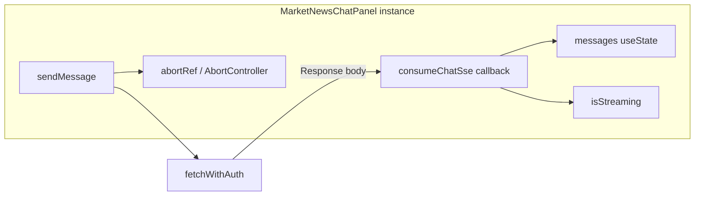
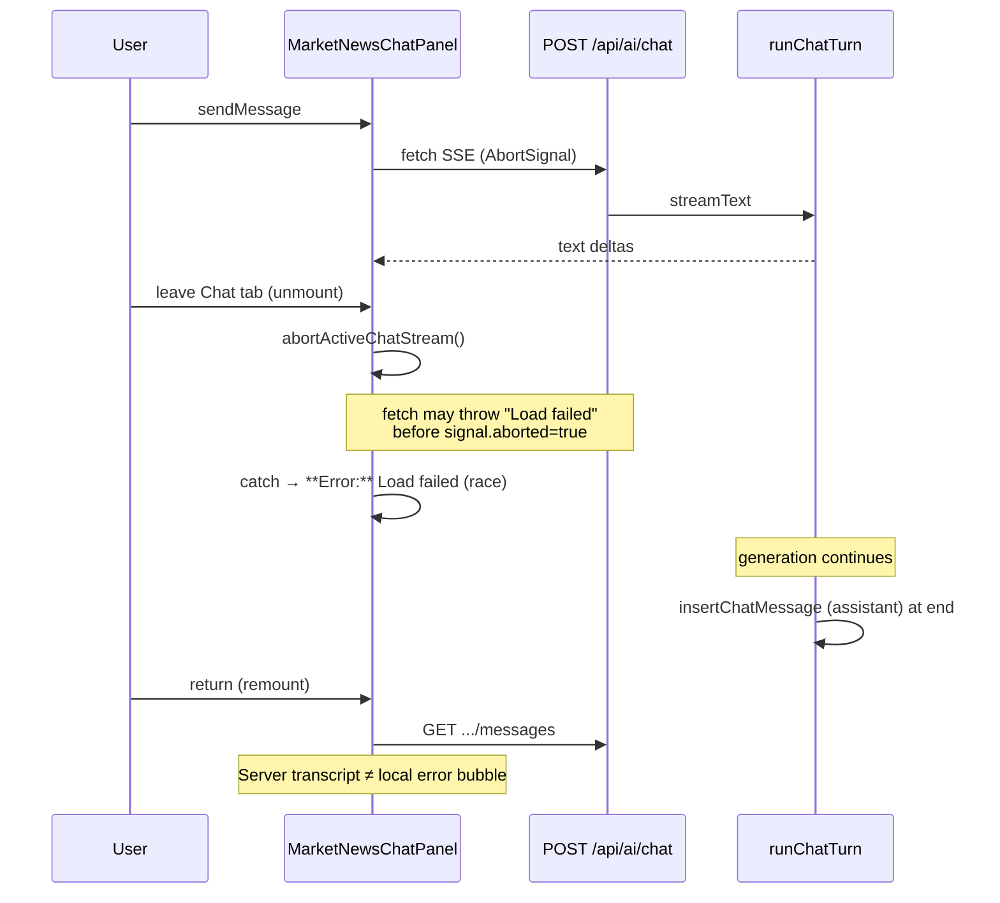

# Chat SSE lifecycle & composer layout audit (read-only)

**Date:** 2026-05-21  
**Baseline:** `main` at `f51a7baf` (includes PR #461 thread persistence, PR merge `2956d592` stream-abort fix)  
**Scope:** Static trace of Markets Chat (`MarketNewsChatPanel`) streaming lifecycle, `/api/ai/chat` SSE server behavior, `"Error: Load failed"` rendering, and composer positioning. **No application source changes.**

**Reported defects:**

1. Starting a chat query, leaving the Chat context tab, and returning shows **`Error: Load failed`** on the assistant message; staying on the tab lets the query complete — streaming appears coupled to component lifecycle.
2. The composer input renders **floating mid-panel** with messages behind/below it instead of bottom-anchored; position stays wrong after keyboard dismiss.

**Path convention:** Frontend paths use the `artifacts/alpha-terminal/` prefix. Backend SSE paths are under the Express backend artifact (`src/lib/chatRouteHandler.ts`, etc.).

---

## Executive summary

| Area | Root cause (audit) |
|------|-------------------|
| **SSE ownership** | Entire stream lifecycle (fetch, `consumeChatSse`, `isStreaming`, accumulating assistant text, tool pills) lives in **`MarketNewsChatPanel` component state/refs** — not a global store or service. |
| **Unmount / E2** | **Present on `main`:** per-send `AbortController`, `abortActiveChatStream()` on `symU` effect cleanup (includes unmount), `isStreaming` reset. Unmount **intentionally aborts** the in-flight stream. |
| **Server disconnect** | **No** `req.on("close")` / abort wiring. Generation runs to completion server-side; assistant row is persisted **only after** the full `streamText` loop finishes. Mid-disconnect: user message already saved, assistant usually **not** persisted. |
| **"Load failed"** | Not a hardcoded app string — **WebKit/Safari `fetch` `TypeError` message**. Surfaced in `sendMessage` `catch` as `**Error:** ${err.message}`. Abort guard (`signal.aborted` / `AbortError`) can **lose a race** with connection teardown, so navigation abort may display as a real error. |
| **Composer layout** | On **narrow mobile** (`max-width: 767px`), composer is **`position: fixed`** and **portaled to `document.body`**, with `bottom: dockBottomPx` from `useVisualViewportComposerMetrics`. Inflated `keyboardInset` / baseline (documented in the hook) pins `bottom` too high → composer **mid-panel**; messages scroll underneath via `paddingBottom` on the scroll region only. |

---

## Phase 1 — SSE ownership map

### 1.1 Component and mount

| Item | Location |
|------|----------|
| UI | `MarketNewsChatPanel` — `artifacts/alpha-terminal/src/components/MarketNewsChatPanel.tsx` (export L104) |
| Mount | `Terminal.tsx` — conditional `{contextTab === "newsChat" && <MarketNewsChatPanel />}` (e.g. L651, L708, L751) |
| Route | SPA; no dedicated chat route |

Leaving the Chat context tab **unmounts** the panel; switching away from Markets unmounts the whole markets subtree.

### 1.2 Where streaming state lives

All streaming-related state is **component-local** (`useState` / `useRef` in `MarketNewsChatPanel.tsx`):

| State / ref | Lines | Role |
|-------------|-------|------|
| `messages` | L144 | Transcript including in-flight assistant placeholder (`content` appended per SSE `text` delta) |
| `isStreaming` | L147 | UI: stop button, thinking dots, retry disable |
| `isStreamingRef` | L153 | Synchronous guard for send/regenerate (paired with `setStreamingState`) |
| `toolPills` | L145 | In-flight tool call chips on last assistant message |
| `activeMultiAgentCount` | L139 | Multi-agent status UI |
| `abortRef` | L152 | Holds active per-send `AbortController` |
| `lastFailedMessage` | L150 | Retry source text |

**Zustand** (`useTerminalStore`): `symbol`, `aiFeatureSettings.chat.model`, `activeChatThreadBySymbol` / `setActiveChatThreadForSymbol` (thread id persistence only — **not** messages or stream text).

**No** React Context, TanStack Query, or dedicated chat service for SSE.

### 1.3 Fetch and SSE consumption — bound to component instance

| Step | File:lines | Notes |
|------|------------|-------|
| Start send | `MarketNewsChatPanel.tsx` L282–436 | `sendMessage` `useCallback` |
| Abort prior stream | L286 | `abortActiveChatStream()` |
| Per-send controller | L320–322 | `new AbortController()` → `abortRef.current` |
| HTTP | L341–349 | `fetchWithAuth("/api/ai/chat", { method: "POST", Accept: "text/event-stream", signal })` |
| SSE parse | L366–403 | `await consumeChatSse(res, onEvent, signal)` |
| SSE utility | `chatSse.ts` L86–137 | `consumeChatSse` — `ReadableStream` reader, `AbortSignal` listener cancels reader on abort |

`consumeChatSse` is a **pure function** but is only invoked from `sendMessage` inside this component. The `onEvent` closure calls `setMessages` / `setToolPills` / `activateThread` on **this** instance’s state setters.

**Server route:** `POST /api/ai/chat` → backend `src/routes/ai.ts` L2505 → `handleChatMessageSse` in `src/lib/chatRouteHandler.ts`.



---

## Phase 2 — Unmount behavior and E2-status

### 2.1 What happens on unmount

When `contextTab !== "newsChat"` or Markets unmounts:

1. React runs effect cleanups, then destroys the instance.
2. **`symU` effect cleanup** (L237–240): `abortActiveChatStream()`.
3. `abortActiveChatStream` (L163–169): `abortRef.current?.abort()`, clears ref, `setStreamingState(false)`, clears `toolPills` and `activeMultiAgentCount`.
4. In-flight `sendMessage` `catch` (L406–407): if `signal.aborted` or `AbortError`, **returns without** writing an error bubble.
5. `finally` (L415–421): clears streaming if this controller is still current.

There is **no separate** `useEffect(() => () => abort(), [])` — unmount abort is **only** via the `symU` effect cleanup (which also runs on symbol change).

### 2.2 Symbol change vs tab leave

On **`symU` change** (same as mount): effect body (L217–240) calls `abortActiveChatStream()` immediately, then async `refreshThreads` + `resolveActiveChatThreadId` restore (PR #461). Does **not** call `setMessages([])` on mount anymore (older audit doc is stale here).

### 2.3 E2 fix directive status on `main`

The directive (per-send `AbortController`, abort on unmount, `isStreaming` reset) is **implemented**:

| Requirement | Location | Status |
|-------------|----------|--------|
| Per-send `AbortController` | L320–322 | **Present** |
| Abort on unmount / symbol cleanup | L239, L220 (`symU` effect) | **Present** |
| `isStreaming` reset on abort | L163–169, L415–421 | **Present** |
| Commit | `2956d592` `fix(chat): abort hung SSE streams and reset isStreaming on symbol change` | **Merged to `main`** |

**Interaction with defect (1):** Abort-on-unmount is **working as designed** and **stops** the client stream when leaving Chat. That explains why staying on the tab completes while leaving does not. The remaining issue is **error surfacing** when abort/teardown presents as `"Load failed"` (Phase 4) and **server-side** generation continuing without client (Phase 3).

### 2.4 Thread persistence on return (context)

`main` also has `64a8c61d`: `activeChatThreadBySymbol` in Zustand (`store.ts` L651–668, persisted via `partialize` `...rest`), restored on mount via `resolveActiveChatThreadId` (`chatPersistence.ts`). Returning to Chat reloads messages from `GET /api/chat/threads/:id/messages` — not from the aborted in-flight placeholder.

---

## Phase 3 — Server behavior on client disconnect

### 3.1 Handler structure

`handleChatMessageSse` — backend `src/lib/chatRouteHandler.ts`:

| Phase | Lines | Behavior |
|-------|-------|----------|
| Auth / validation | L28–49 | 401/400 JSON if invalid |
| Thread resolve / create | L63–73 | Creates thread if needed |
| SSE headers | L77–82 | `text/event-stream` |
| Initial events | L84–95 | `thread`, optional `status` |
| Heartbeat | L97–99 | `: ping` every 15s |
| Generation | L140–148 | `runChatTurn` or `runMultiAgentChatTurn` |
| Errors | L149–155 | SSE `error` event |
| End | L156–159 | `clearInterval`, `res.end()` |

**Not present:** `req.on("close")`, `req.aborted`, linking disconnect to `AbortSignal` for the LLM, or early exit when the client socket closes.

`onEvent` checks `res.writableEnded` (L108) before writing — avoids writes after the response is ended, but **does not stop** upstream generation.

### 3.2 Orchestrator persistence model

`runChatTurn` — `chatOrchestrator.ts` L290–347:

1. **`prepareTurnMessages`** (L169–173): **`insertChatMessage` user row immediately** before streaming.
2. **`streamText`** loop (L314–331): streams deltas to client via `onEvent({ type: "text", delta })`.
3. **After stream completes** (L333–342): `insertChatMessage` assistant row with full `finalText`, then `onEvent({ type: "done", ... })`.

There is **no** incremental assistant persistence during the stream.

`runMultiAgentChatTurn` (L214–287): same pattern for synthesizer output (drafts not persisted).

### 3.3 Client disconnect mid-stream

| Question | Answer |
|----------|--------|
| Does generation continue? | **Yes** — `streamText` / `for await` is not tied to client socket |
| Is generation aborted server-side? | **No** — no disconnect listener |
| Partial assistant persisted? | **No** — only final insert after completion |
| User message persisted? | **Yes** — at turn start |
| SSE `done` received by client? | **No** if disconnected |
| `writableEnded` | Stops further **writes** to dead socket; generation may still run |

If the client aborts and reconnects later, reloading the thread typically shows the **user** message and **no** assistant reply (or a full assistant reply if the server finished before reload).

---

## Phase 4 — Error rendering path (`"Error: Load failed"`)

### 4.1 String origin

**`"Load failed"` does not appear in application source.** It is a common **WebKit** message on failed `fetch` (`TypeError`). `fetchWithAuth.ts` L117 explicitly logs diagnostics matching `/load failed/i`.

### 4.2 UI rendering path

Assistant errors use markdown `**Error:** …` rendered via `ReactMarkdown` (L803–804).

| Source | File:lines | Condition | Message |
|--------|------------|-----------|---------|
| HTTP / HTML | `MarketNewsChatPanel.tsx` L352–363 | `!res.ok` or HTML content-type | `**Error:** Server returned {status}` or `Unexpected HTML response` |
| SSE `error` event | L396–401 | `ev.type === "error"` | `**Error:** ${ev.message}` |
| **`catch` (network/abort)** | **L406–414** | See below | **`**Error:** ${err.message}`** (fallback `"Connection failed"`) |
| Multi-agent guard | L289–301 | &lt; 2 models | `**Error:** Select at least two models…` |

### 4.3 `catch` block — abort vs real failure

```406:414:artifacts/alpha-terminal/src/components/MarketNewsChatPanel.tsx
      } catch (err: unknown) {
        if (signal.aborted || (err as Error).name === "AbortError") return;
        const errMsg = (err as Error).message || "Connection failed";
        setMessages((prev) =>
          prev.map((m) =>
            m.id === assistantId ? { ...m, content: `**Error:** ${errMsg}`, retryable: true } : m,
          ),
        );
```

| Check | Handles |
|-------|---------|
| `signal.aborted` | Intended: navigation / stop after `abort()` |
| `err.name === "AbortError"` | Standard abort (including `consumeChatSse` DOMException L81–83) |
| **Not checked** | `TypeError` + message `"Load failed"` when **`signal.aborted` is still false** |

**Race:** Tab leave or OS teardown can drop the connection **before** `abort()` propagates, producing `TypeError: Load failed` with `signal.aborted === false`. The catch then writes **`**Error:** Load failed`** to the assistant placeholder.

`consumeChatSse` throws `AbortError` when `signal.aborted` during read (L94–96, L110, L118, L124) — but `fetch` may fail first with WebKit’s `"Load failed"`.

### 4.4 Distinction from navigation abort

| Path | User-visible error? |
|------|---------------------|
| Clean abort (`signal.aborted` true or `AbortError`) | **No** — silent return |
| WebKit `Load failed` on aborted connection (race) | **Yes** — `**Error:** Load failed` |
| Genuine network / server failure | **Yes** — same `catch` |

There is **no** user-facing copy that says “cancelled because you left the tab.”

### 4.5 Why the error may appear “on return”

On unmount, component state is discarded. After return, messages usually come from **`loadThreadMessages`** (server), which would **not** include `"Load failed"` unless it were stored server-side (it is not).

Plausible explanations aligned with code:

1. **User sees the error on the outgoing view** (catch runs, one frame painted) before unmount, and describes it as “when I came back.”
2. **Race on return:** remount starts a new session while a **visible** failed placeholder from a **slow** `catch` on the dying instance is briefly visible (uncommon).
3. **Same-tab / no unmount** path not found in `Terminal.tsx` — conditional mount always unmounts.
4. **Retry** after return surfaces the same message from a new failed send.

---

## Phase 5 — Composer layout findings

### 5.1 Composer component and placement

| Item | Location |
|------|----------|
| Render fn | `renderComposer()` — `MarketNewsChatPanel.tsx` L505–573 |
| Desktop / wide | L509–511: `relative z-[60] shrink-0` — **flex child** at bottom of column |
| Narrow mobile | L509–510, L860–862: `fixed left-0 right-0 z-[10050]` + **`createPortal(..., document.body)`** |

### 5.2 Panel layout structure

Root panel (L576):

```576:576:artifacts/alpha-terminal/src/components/MarketNewsChatPanel.tsx
    <div className="relative flex flex-col flex-1 min-h-0 max-h-[calc(100dvh-9.5rem)] md:max-h-none md:min-h-[280px] bg-[#0a0a0a] border-t border-card-border/40">
```

| Region | Classes | Role |
|--------|---------|------|
| Header | `shrink-0` (L577) | Model / threads chrome |
| Body | `relative flex-1 min-h-0 flex flex-col` (L689) | Threads overlay + message scroller |
| Message scroller | `flex-1 min-h-0 overflow-y-auto` (L763–765) | Scrollable transcript |
| Composer | Outside scroller; portal on mobile | Input |

**Viewport meta:** `index.html` L5 — `interactive-widget=overlays-content` (keyboard overlays layout; drives VisualViewport logic).

### 5.3 Mobile positioning mechanics

| Input | Lines | Effect |
|-------|-------|--------|
| `narrowMobile` | L171 | `useMediaQuery("(max-width: 767px)")` |
| `dockReservePx` | L172 | `composerFocused ? 0 : 78` — bottom tab bar reserve when unfocused |
| `useVisualViewportComposerMetrics` | L173–175 | `dockBottomPx = max(reservePx, keyboardInset)` |
| Composer `style.bottom` | L514–518 | `bottom: dockBottomPx` (fixed) |
| Scroller `paddingBottom` | L766–769 | `calc(44px + ${dockBottomPx}px + safe-area)` so content clears composer |

**Focus hooks:** `onFocus` / `onBlur` on textarea (L536–543) set `composerFocused` and call `remeasure()`.

### 5.4 Cause of mid-panel floating composer

On mobile the composer is **`position: fixed`** relative to the **layout viewport**, not the chat panel’s flex box. If `dockBottomPx` is **too large**, `bottom` pushes the form **up** into the middle of the screen; the message list (normal flow + scroll) continues **behind and below** the floating bar.

`useVisualViewportComposerMetrics` (`useVisualViewportKeyboardInset.ts`) documents this failure mode:

```81:85:artifacts/alpha-terminal/src/hooks/useVisualViewportKeyboardInset.ts
        /**
         * Prefer the direct inset whenever it is clearly non-zero. Taking `max(direct, baseline)`
         * permanently let an inflated baseline dominate on some iOS builds, which set
         * `position: fixed; bottom: …` hundreds of px too high — the composer floated mid-screen
         * with chat scrolling underneath.
```

| Mode | Inset algorithm (L76–91) |
|------|---------------------------|
| `composerFocused === false` | `raw = min(max(0, directInset), cap)` — **ignores** monotonic baseline (mitigation for post-keyboard stuck inset) |
| `composerFocused === true` | Prefer `directInset` when ≥ 20px, else `max(direct, fromBaseline)` |

**Stuck mid-panel after keyboard dismiss:** If `keyboardInset` / baseline stays inflated when `composerFocused` goes false, `dockBottomPx` can remain ≈78–数百px until `visualViewport` `resize`/`scroll` fires and `remeasure()` runs. Blur calls `remeasure()` (L541–542), but **stale baseline** (L98–101: only refreshed when `next < 72`) can still leave a large inset on some iOS builds.

**Portal side effect:** Composer is **outside** the panel DOM hierarchy → not anchored by parent `flex-col`; entirely dependent on `dockBottomPx` accuracy.

### 5.5 Desktop behavior

Composer is `relative shrink-0` at the end of the flex column (L860–862 inline render) — **expected bottom anchor**. Mid-panel defect is **mobile/narrow** (`fixed` + VisualViewport), consistent with `interactive-widget=overlays-content` PWA behavior.

---

## Cross-phase diagram (defect 1)



---

## Files reviewed

| File | Relevance |
|------|-----------|
| `artifacts/alpha-terminal/src/components/MarketNewsChatPanel.tsx` | SSE send, abort, composer, errors |
| `artifacts/alpha-terminal/src/lib/chatSse.ts` | `consumeChatSse`, abort reader cancel |
| `artifacts/alpha-terminal/src/lib/fetchWithAuth.ts` | fetch wrapper, Load failed logging |
| `artifacts/alpha-terminal/src/lib/chatPersistence.ts` | Thread restore on remount |
| `artifacts/alpha-terminal/src/lib/store.ts` | `activeChatThreadBySymbol` persist |
| `artifacts/alpha-terminal/src/hooks/useVisualViewportKeyboardInset.ts` | Composer `bottom` / keyboard inset |
| `artifacts/alpha-terminal/src/pages/Terminal.tsx` | Conditional mount |
| `artifacts/alpha-terminal/index.html` | `interactive-widget=overlays-content` |
| backend `src/lib/chatRouteHandler.ts` | SSE endpoint |
| backend `src/lib/chatOrchestrator.ts` | Persistence timing |
| backend `src/routes/ai.ts` | `/api/ai/chat` route |

---

## Suggested fix directions (informational; out of audit scope)

1. **Decouple stream from tab mount:** Lift in-flight stream + partial text to a module-level or Zustand store (or keep panel mounted hidden) so navigation does not abort consumer-side.
2. **Harden abort handling:** In `catch`, treat `TypeError` + `/load failed/i` as abort when `abortRef` was cleared or navigation flag set; or use `AbortSignal.reason`.
3. **Server disconnect:** Register `req.on("close")` and abort `streamText` (AI SDK abort signal) to save tokens; optionally persist partial assistant on cancel.
4. **Composer:** Anchor mobile composer inside the panel flex column (no body portal) or drive `bottom` from `--vv-top` / `env(keyboard-inset-height)`; reset baseline aggressively on blur.

---

## Related audits

- `docs/audits/chat-state-lifecycle-audit-2026-05-21.md` — thread/message persistence (partially superseded by PR #461 on `main`)
- `docs/audits/chat-send-path-audit-2026-05-21.md` — send guards and silent exits (note: “E2” there means `isStreaming` guard, not abort-on-unmount)
