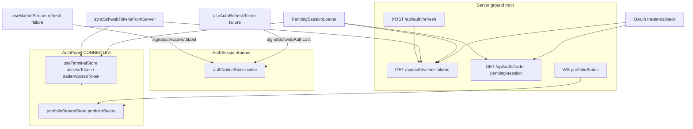

# Schwab connection state & OAuth navigation audit (2026-05-21)

<!-- pragma: allowlist secret -->

**Scope:** Static read-only trace of Schwab connection UI state and OAuth callback navigation in the alpha-terminal frontend package, with supporting OAuth and portfolio WebSocket behavior on the API server (auth routes and ws portfolio poll).  
**Baseline:** `main` (audit branch `cursor/schwab-connection-audit-d476`).  
**Questions:**

1. Why can the yellow **Schwab session** banner and the **SCHWAB CONNECTED** status row appear at the same time?
2. Why does completing OAuth from the sidebar connect screen leave the user on that same connect screen instead of a “usable” main view?

**No application source files were modified** — only this document.

---

## Executive summary

| Symptom | Root cause (code-level) |
|---------|-------------------------|
| Banner + **CONNECTED** row together | Two **independent** state sources: global `authNoticeStore.notice` (banner) vs client Zustand tokens + WS `portfolioStatus` (row). Reconnect success updates tokens and can clear `portfolioStatus.no_token`, but **nothing clears `notice`** except manual dismiss. |
| Stuck on connect screen after OAuth | OAuth is designed **not** to navigate the PWA (`target="_blank"` + static success HTML). The **Linked Brokerage** sidebar overlay stays mounted because `activePage` is never cleared on OAuth return. User lands back on the same overlay they started from. |

**Stale UI relative to server ground truth after successful reconnect:** the **banner** (`authNoticeStore.notice`) is stale; the **CONNECTED** row aligns with server session once tokens are synced and `portfolioStatus` returns to `"ok"`.

---

## Phase 1 — Connection state map

### 1.1 Yellow “Schwab session” banner

| Item | Detail |
|------|--------|
| **Component** | `AuthSessionBanner` — `artifacts/alpha-terminal/src/components/AuthSessionBanner.tsx` |
| **Mount** | Global in `App.tsx` L236 (above router; always visible when `notice` is set) |
| **Visibility flag** | `useAuthNoticeStore((s) => s.notice)` — banner renders when `notice !== null` (L16) |
| **Title** | L38–39: uppercase **“Schwab session”** when `notice.kind === "schwab"` |
| **Body** | L41: `notice.message`; L42–44: optional `notice.detail` |
| **CTA** | L48–73: **Reconnect Schwab** anchor via `useBrokerConnect()` (`oauthUrl`, `onClick`, `isNavigating`) |
| **Dismiss** | L87–94: `dismiss()` only — no automatic clear on reconnect |

**Store:** `artifacts/alpha-terminal/src/lib/authNoticeStore.ts`

| Field / API | Lines | Role |
|-------------|-------|------|
| `notice: AuthNotice \| null` | 11–13, 29–31 | Single global notice (not persisted) |
| `setNotice` | 31 | Set by `signalSchwabAuthLost` / `signalClerkAuthLost` |
| `dismiss` | 32–37 | Clears `notice` and debounce map |
| `signalSchwabAuthLost(message, detail?)` | 41–44 | Sets `{ kind: "schwab", message, detail }` with 45s debounce per kind (L18–27) |

**Who sets the banner (Schwab reconnect flag):**

| Caller | File:lines | Trigger | Typical `message` / `detail` |
|--------|-----------|---------|------------------------------|
| Auto token refresh failure | `useAutoRefreshToken.ts` L37–41 | `POST /api/auth/refresh` returns 400 and body matches revoked pattern (L31–33) | **“Schwab login could not be renewed automatically.”** + `schwabRefreshErrorDetail(bodyText)` |
| Market stream auth failure | `useMarketStream.ts` L100–103 | `refreshSchwabViaServer()` fails after stream rejection | **“Schwab stream rejected the current login.”** + live-data pause copy |

**Reported copy “No Schwab session on server — reconnect Schwab”:** server message from `refreshSchwabKind` when no server refresh token exists (`refreshSchwabKind` in the API auth routes module, lines 374–380): `missing_refresh_token` / message **No Schwab session on server — reconnect Schwab**.

Frontend passes API `message` into the banner via `schwabRefreshErrorDetail` (`schwabTokenSync.ts` L72–80) as `notice.detail` (`useAutoRefreshToken.ts` L30, L39–40).

**On auth loss, refresh failure also clears client tokens** (`useAutoRefreshToken.ts` L46–47; `useMarketStream.ts` L104–105).

---

### 1.2 “SCHWAB CONNECTED” status row

| Item | Detail |
|------|--------|
| **Component** | `AuthPanel` — `artifacts/alpha-terminal/src/components/AuthPanel.tsx` |
| **Surface** | `LinkedBrokeragePage` in `Sidebar.tsx` L370–377 → `<AuthPanel />` |
| **CONNECTED branch** | L69–91 when `isConnected && !serverTokenExpired` |
| **Labels** | L77–78: **SCHWAB** + **CONNECTED** (green) |

**State controlling the row:**

| Derived flag | Definition | File:lines |
|--------------|------------|------------|
| `isConnected` | `!!(accessToken \|\| traderAccessToken)` | `AuthPanel.tsx` L15 |
| `serverTokenExpired` | `portfolioStatus.status === "no_token"` | `AuthPanel.tsx` L16 |

**Origins:**

| State | Store / hook | Persistence | Set by |
|-------|--------------|-------------|--------|
| `accessToken`, `traderAccessToken` | `useTerminalStore` | **Yes** — Zustand `persist` (`store.ts` L465–475, storage name `alpha-terminal-storage`) | `setTokens` / `setTraderTokens`; cleared by `clearTokens` / `clearTraderTokens` |
| `portfolioStatus` | `usePortfolioStreamStore` | **No** (in-memory) | WebSocket `portfolioStatus` event (`useMarketStream.ts` L271–272 → `setPortfolioStatus`); forced `{ status: "ok" }` on account payload (`portfolio-stream-store.ts` L52) |

**Other `AuthPanel` branches (for contrast):**

| Condition | UI | Lines |
|-----------|-----|-------|
| `isConnected && serverTokenExpired` | **SESSION EXPIRED** + reconnect CTA | L37–66 |
| `!isConnected` | **DISCONNECTED** + connect CTA | L95–123 |

---

### 1.3 Server-side session ground truth

The UI does **not** use one unified “Schwab connected” flag. Ground truth is split across endpoints/events:

| Source | Endpoint / channel | What it represents | Used for |
|--------|-------------------|--------------------|----------|
| **Server token store** | `GET /api/auth/server-tokens` (`auth.ts` L594–601) | `hasValidTokens("market" \| "trader")` → access/refresh + expiry | `PendingSessionLoader` (`App.tsx` L48–61), `syncSchwabTokensFromServer` (`schwabTokenSync.ts` L21–32) |
| **One-shot OAuth pickup** | `GET /api/auth/trader-pending-session` (`auth.ts` L561–572) | Tokens stored at `trader-callback`, consumed once within 5 min | `PendingSessionLoader` (`App.tsx` L77–86) |
| **Refresh grant** | `POST /api/auth/refresh` (`auth.ts` L448–459) | Server-owned refresh via `refreshSchwabKind` | `refreshSchwabViaServer` (`schwabTokenSync.ts` L36–69), `useAutoRefreshToken` |
| **Portfolio stream** | WS `portfolioStatus` (`wsServer.ts` L320–329) | `no_token` when `getTokens("trader")` has no access token | `AuthPanel` `serverTokenExpired`, `PortfolioView` gate, `SchwabSessionExpiredDialog` |

**Canonical “server has Schwab session” for API work:** tokens in server `tokenStore` (read via `/api/auth/server-tokens` and used by portfolio poll in `wsServer.ts` L320–322).

**Canonical “live portfolio authorized” for the row’s server leg:** WS `portfolioStatus.status !== "no_token"` (driven by same server trader token).

**CONNECTED row “connected” leg:** client Zustand tokens (`isConnected`), which may lag or lead server until sync/pending pickup.

---

### 1.4 State map diagram



---

## Phase 2 — Reconnect-success path

### 2.1 End-to-end flow (primary PWA path)

| Step | Location | Action |
|------|----------|--------|
| 1 | User clicks `<a href={oauthUrl} target="_blank">` | `useBrokerConnect.onClick` sets `isNavigating` (`useBrokerConnect.ts` L64–71) |
| 2 | Browser opens Schwab OAuth (overlay / tab) | PWA route **unchanged** |
| 3 | Schwab redirects | `GET /api/auth/trader-callback` (`auth.ts` L483–554) |
| 4 | Server | `storeTokens("trader" \| "market")`, `pendingTokens.set("trader_latest")` (L548–551) |
| 5 | Response | `traderSuccessPage()` HTML — **no redirect to SPA** (L90–127, L554) |
| 6 | User closes overlay (X / **CLOSE THIS PAGE**) | `visibilitychange` / `focus` / `pageshow` on PWA |
| 7 | Token pickup | See §2.2 |
| 8 | `useBrokerConnect` | Clears `isNavigating` when tokens appear (L74–84) or 4s after foreground (L91–105) |

### 2.2 Token pickup handlers (what updates on success)

| Handler | Condition | Updates | Clears banner `notice`? |
|---------|-----------|---------|-------------------------|
| `PendingSessionLoader` | Effect runs only when **both** client tokens are null (`App.tsx` L44) | `setTokens` + `setTraderTokens` from `server-tokens`, `pending-session`, or `trader-pending-session` (L48–86) | **No** |
| `syncSchwabTokensFromServer` | Called on tab visible if `schwabSessionActive()` (`useAutoRefreshToken.ts` L92–96) | Overwrites client tokens from `server-tokens` | **No** |
| `refreshSchwabViaServer` | After sync / interval | May update tokens from refresh response | **No** |
| `useBrokerConnect` | `accessToken \|\| traderAccessToken` | `isNavigating → false`, refetch `trader-url` | **No** |
| `setPortfolioAccount` (WS) | `portfolioAccount` event | `portfolioStatus: { status: "ok" }` (`portfolio-stream-store.ts` L52) | **No** |
| `SchwabSessionExpiredDialog` | `!serverTokenExpired` | `setOpen(false)`, reset dismiss key (L52–56) | **No** (dialog only) |
| `authNoticeStore.dismiss` | Manual X on banner | `notice → null` | **Only path** that clears banner without reload |

**Grep confirmation:** `signalSchwabAuthLost` is only called from `useAutoRefreshToken.ts` and `useMarketStream.ts`. Nothing calls `setNotice(null)` or `dismiss()` on reconnect success.

### 2.3 Contradictory banner + CONNECTED row

**Required state:**

- `notice !== null` (banner visible)
- `accessToken || traderAccessToken` truthy
- `portfolioStatus.status !== "no_token"` (CONNECTED branch, not SESSION EXPIRED)

**Typical sequence:**

1. Auto-refresh fails → `signalSchwabAuthLost("Schwab login could not be renewed automatically.", detail with **No Schwab session on server…**)` + `clearTokens()` (`useAutoRefreshToken.ts` L37–47).
2. User completes OAuth; server stores tokens (`auth.ts` L548–551).
3. User returns to PWA → `PendingSessionLoader` and/or `syncSchwabTokensFromServer` repopulate client tokens.
4. Portfolio WS eventually sends account data → `portfolioStatus` → `"ok"`.
5. **`notice` never cleared** → banner remains; **AuthPanel** shows **CONNECTED**.

### 2.4 Stale vs fresh (relative to server session)

| UI element | After successful reconnect | vs server `server-tokens` / WS |
|------------|---------------------------|--------------------------------|
| **AuthSessionBanner** | Still shows prior auth-loss notice | **Stale** |
| **AuthPanel CONNECTED** | Reflects client tokens + `portfolioStatus` ok | **Fresh** (once sync/pickup completes) |
| **AuthPanel SESSION EXPIRED** | Hidden when `portfolioStatus` ok | N/A |

### 2.5 Edge case: `PendingSessionLoader` skipped if client tokens still set

`PendingSessionLoader` returns immediately when `accessToken || traderAccessToken` is truthy (`App.tsx` L44). If OAuth completes on the server but the client was **not** cleared (e.g. refresh failure path that did not match `isRevoked`, or race with persisted tokens), pending-session polling never runs. Recovery may still occur via `syncSchwabTokensFromServer` on visibility (`useAutoRefreshToken.ts` L92–96) **only if** `schwabSessionActive()` — which requires some client token material.

---

## Phase 3 — OAuth callback navigation

### 3.1 Connect action → OAuth

**Primary implementation:** `useBrokerConnect` (`artifacts/alpha-terminal/src/hooks/useBrokerConnect.ts`)

| Step | Lines | Behavior |
|------|-------|----------|
| Prefetch URL | L32–44, L47–59 | `GET /api/auth/trader-url` |
| Open OAuth | L64–71 + anchor `target="_blank"` | Browser navigates href; PWA stays mounted |
| Design note | L8–19 | Avoids `window.open` / same-tab navigation that unmounts PWA |

**Alternate (full-page navigation):** `window.location.href = url` — used by `SchwabSessionExpiredDialog.tsx` L59–70 (`useGetAuthUrl` → `/api/auth/url`) and `MarketPulseDashboard.tsx` L318–329. Still **no** post-auth return URL in app state.

### 3.2 Callback handler (server)

| Route | Response | SPA navigation? |
|-------|----------|-----------------|
| `GET /api/auth/trader-callback` | `traderSuccessPage()` static HTML | **No** — intentional (L90–103) |
| `GET /api/auth/callback` (legacy) | `res.redirect("/")` (L245) | Yes, but not used by current `trader-url` flow |

**Success page “Done” equivalent:** button label **CLOSE THIS PAGE** (`auth.ts` L113–124); calls `window.close()` (no-op on many iOS overlays). User typically uses system **X**; comment L111–112 instructs tapping **X** to return.

### 3.3 After OAuth — where the user lands

| Layer | Behavior |
|-------|----------|
| **Wouter router** | Unchanged — still on prior route (usually `/` → `TerminalPage`) |
| **Sidebar overlay** | If `activePage === "Linked Brokerage"`, portal overlay **remains** (`Sidebar.tsx` L183–214) |
| **Menu close** | `onClose()` only closes drawer (`setSidebarOpen(false)`); **does not** clear `activePage` (L268) |

So completing OAuth and closing the overlay returns the user to whatever was underneath — often the terminal with the **Linked Brokerage** full-screen panel still open. That panel is the “connect screen” (`AuthPanel` connect/disconnect UI), not a separate route.

**No pre-reconnect return location:** repo-wide search found no `returnTo`, `returnUrl`, `return_to`, or OAuth return capture in `artifacts/alpha-terminal`.

### 3.4 Token bridge (why portfolio “loads automatically”)

Comment on success page (`auth.ts` L112): PWA `visibilitychange` → `PendingSessionLoader` → `/api/auth/trader-pending-session` (also `server-tokens`). Documented fix for 30s cooldown blocking post-OAuth poll (`App.tsx` L89–92).

### 3.5 Sequence diagram

```mermaid
sequenceDiagram
  participant User
  participant PWA as Alpha Terminal PWA
  participant Overlay as OAuth overlay/tab
  participant API as API server
  participant Schwab

  User->>PWA: Linked Brokerage → CONNECT (activePage stays set)
  PWA->>Overlay: target=_blank trader-url
  Overlay->>Schwab: authorize
  Schwab->>API: trader-callback?code=
  API->>Overlay: Connected HTML (CLOSE / X)
  User->>Overlay: dismiss
  Overlay-->>PWA: visibilitychange
  PWA->>API: trader-pending-session / server-tokens
  API-->>PWA: tokens
  Note over PWA: Router unchanged; Linked Brokerage overlay still visible
  Note over PWA: authNoticeStore.notice unchanged if banner was shown
```

---

## Phase 4 — Reconnect entry points & return location

### 4.1 Entry points table

| Entry point | Component / file | OAuth launch | Return location recorded? |
|-------------|------------------|--------------|---------------------------|
| **Banner RECONNECT** | `AuthSessionBanner.tsx` L48–73 | `useBrokerConnect` — `<a target="_blank" href={oauthUrl}>` | **None** |
| **Sidebar Linked Brokerage** | `Sidebar.tsx` L268 → `LinkedBrokeragePage` → `AuthPanel.tsx` L107–120 (connect) or L50–64 (reconnect) | Same `useBrokerConnect` anchor pattern | **None**; **`activePage` left as `"Linked Brokerage"`** |
| **Portfolio gate** | `PortfolioView.tsx` `ReconnectSchwabButton` L1001–1032 | `useBrokerConnect` | **None** |
| **Connect broker prompts** | `ConnectBrokerPrompt.tsx` (MetricsBar, Options, Scanner, etc.) | `useBrokerConnect` | **None** |
| **Session expired dialog** | `SchwabSessionExpiredDialog.tsx` L107–116 | `window.location.href` to `/api/auth/url` | **None** (full-page leave; return is browser history / same URL) |
| **Market Pulse connect** | `MarketPulseDashboard.tsx` L318–329 | `window.location.href` | **None** |

### 4.2 Implicit “return location” behavior

Because nothing is stored:

- **PWA anchor path:** User returns to the **same SPA URL and same sidebar `activePage`** as before OAuth.
- **Linked Brokerage from menu:** `setActivePage("Linked Brokerage"); onClose()` (L268) → drawer closes, **overlay stays** → user perceives “still on connect screen.”
- **Banner path:** Underlying page unchanged; banner remains until dismiss.
- **Full-page `location.href` paths:** Reload/navigation may remount app at `/`; still no explicit post-OAuth route to portfolio/markets.

`clearActivePage()` exists on `SidebarHandle` (`Sidebar.tsx` L161) but is only invoked from bottom-nav tab changes (`Terminal.tsx` L781, L801), not from OAuth completion.

### 4.3 Settings vs menu path to connect UI

- **Menu → Linked Brokerage:** direct `activePage` (L268).
- **Settings hub:** no dedicated “Linked Brokerage” row in `SettingsHubPage`; brokerage auth is under menu **Linked Brokerage**, not a settings sub-page route.

---

## Findings summary

| ID | Finding | Severity (UX) |
|----|---------|----------------|
| F1 | `authNoticeStore.notice` is set on auth loss but **never** cleared on reconnect success — only manual `dismiss()` | **High** — explains banner + CONNECTED |
| F2 | `AuthPanel` **CONNECTED** uses **client** tokens; banner uses **orthogonal** notice store | **High** — dual sources of truth in UI |
| F3 | Server message **“No Schwab session on server — reconnect Schwab”** maps to banner `detail` via refresh API (`auth.ts` L379, `schwabRefreshErrorDetail`) | **Info** — matches reported copy |
| F4 | OAuth success deliberately avoids SPA redirect (`traderSuccessPage`); PWA position unchanged | **By design** |
| F5 | `activePage === "Linked Brokerage"` persists through OAuth → user returns to connect overlay | **High** — explains post-OAuth “same connect screen” |
| F6 | No return-url / post-auth routing mechanism in frontend | **High** — no way to send user to portfolio/markets after connect |
| F7 | `PendingSessionLoader` no-ops when client tokens already present (`App.tsx` L44) | **Medium** — edge recovery path |

---

## Suggested fix directions (audit only — not implemented)

1. Clear `authNoticeStore` (or `dismiss()` for `kind === "schwab"`) when `setTokens`/`setTraderTokens` runs from pending/server sync, or when `portfolioStatus` transitions to `"ok"` after `no_token`.
2. After successful `trader-pending-session` pickup, call `sidebarRef.current?.clearActivePage()` and/or navigate to `portfolio` tab.
3. Optionally unify “connected” UI on `GET /api/auth/server-tokens` rather than client-only `isConnected`.
4. Run `PendingSessionLoader` checks on visibility even when stale client tokens exist, or clear client tokens before OAuth anchor click.

---

## File index

| Path | Relevance |
|------|-----------|
| `artifacts/alpha-terminal/src/components/AuthSessionBanner.tsx` | Schwab session banner |
| `artifacts/alpha-terminal/src/lib/authNoticeStore.ts` | Banner state |
| `artifacts/alpha-terminal/src/components/AuthPanel.tsx` | CONNECTED / EXPIRED / DISCONNECTED row |
| `artifacts/alpha-terminal/src/hooks/useBrokerConnect.ts` | OAuth URL + navigation loading |
| `artifacts/alpha-terminal/src/App.tsx` | `PendingSessionLoader`, banner mount |
| `artifacts/alpha-terminal/src/hooks/useAutoRefreshToken.ts` | Auto-renew failure → banner |
| `artifacts/alpha-terminal/src/hooks/useMarketStream.ts` | Stream failure → banner; `portfolioStatus` |
| `artifacts/alpha-terminal/src/lib/schwabTokenSync.ts` | Server token sync / refresh |
| `artifacts/alpha-terminal/src/lib/portfolio-stream-store.ts` | `portfolioStatus` |
| `artifacts/alpha-terminal/src/lib/store.ts` | Persisted client tokens |
| `artifacts/alpha-terminal/src/components/Sidebar.tsx` | Linked Brokerage overlay + `activePage` |
| Server `auth.ts` routes | OAuth callbacks, refresh, `server-tokens` |
| Server `wsServer.ts` | WS `portfolioStatus` / `no_token` |
